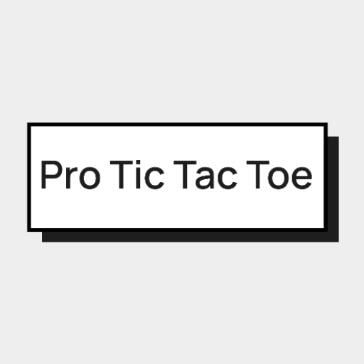
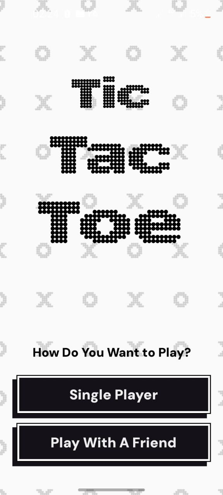
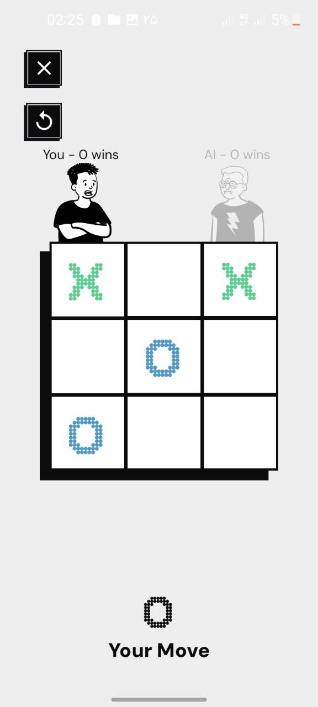
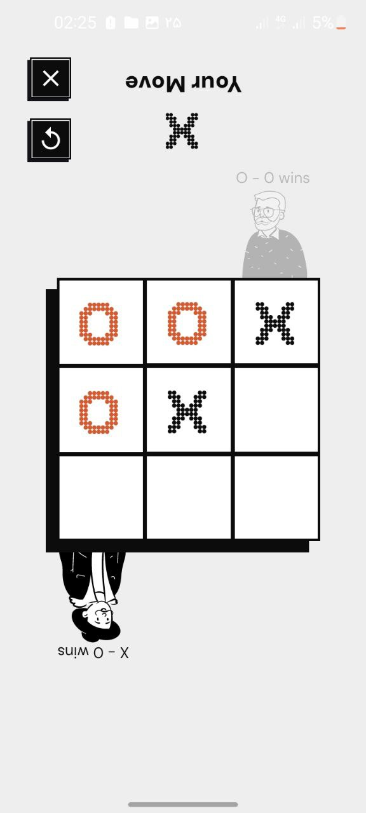
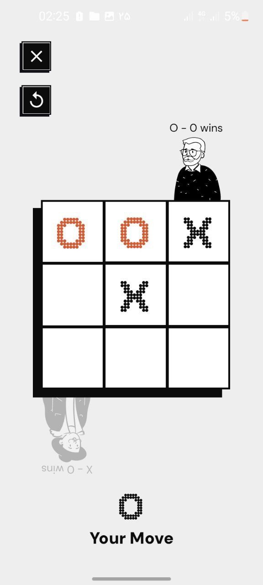
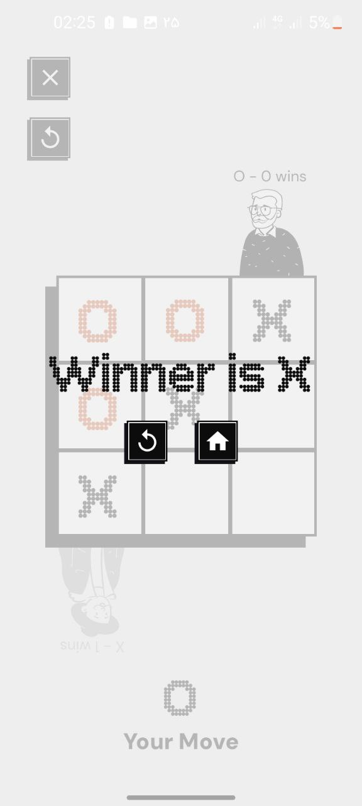

#  Pro Tic Tac Toe

Un **juego de Tres en Raya** desarrollado con **Kotlin** y **Jetpack Compose** para Android.  
Juega contra un amigo en una interfaz intuitiva y limpia. Creado como un proyecto divertido para explorar
el desarrollo moderno de Android.

## 🚀 Características

- Modo Jugador vs Jugador (local)
- Jugador vs IA
- 3 dificultades diferentes para la **IA**
- Interfaz de usuario limpia y minimalista usando **Jetpack Compose**
- Soporte para **Localización**

## 🧑🏻‍💻 Tecnologías Utilizadas
- Lenguaje de programación **Kotlin**
- Kit de herramientas de interfaz de usuario **Jetpack Compose**
- Navegación con **Compose Navigation**
- Inyección de dependencias con **Hilt**
- Cliente HTTP con **Retrofit**
- Sabores de producto (**Flavors**) para **Myket** y **Bazaar**

## 🖼️ Capturas de pantalla

<table>
  <tr>
    <th style="width: 220px; text-align: center;">Pantalla Principal</th>
    <th style="width: 220px; text-align: center;">Modo vs IA</th>
    <th style="width: 220px; text-align: center;">vs Amigo (1)</th>
    <th style="width: 220px; text-align: center;">vs Amigo (2)</th>
    <th style="width: 220px; text-align: center;">Fin del Juego</th>
  </tr>
  <tr>
    <td >
      
    </td>
    <td >
      
    </td>
    <td >
      
    </td>
    <td >
      
    </td>
    <td >
      
    </td>
  </tr>
</table>

## 📚 Descarga

Puedes descargar este juego desde los siguientes enlaces:

- [Descargar desde Bazaar](https://cafebazaar.ir/app/com.amirali_apps.tictactoe?ref=share)
- [Descargar desde Myket](https://myket.ir/app/com.amirali_apps.tictactoe)

## Licencia

Este proyecto está licenciado bajo la **GNU Affero General Public License v3.0** (AGPLv3).

Lee la licencia completa en el archivo [LICENSE](./LICENSE).

En resumen:
- Puedes **usar**, **estudiar** y **modificar** el código.
- Si lo ejecutas como un **servicio público** (por ejemplo, un juego en un sitio web), debes **compartir el código fuente completo**.
- No puedes **cerrar el código fuente ni reempaquetar el proyecto con fines comerciales**.
