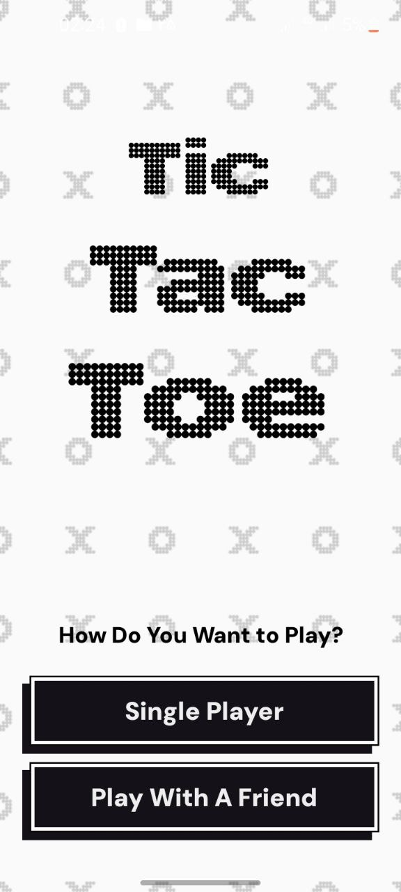
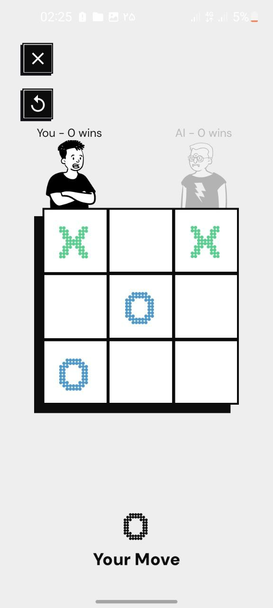
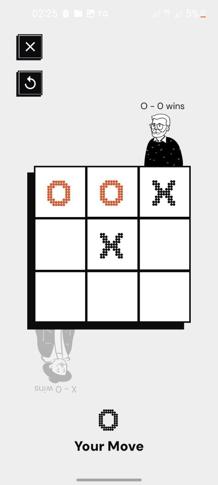
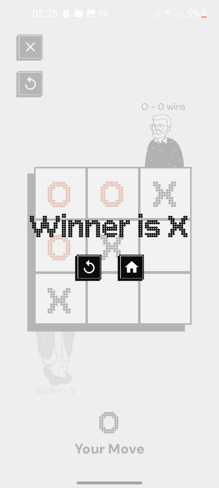

# Pro Tic Tac Toe

A Pro **Tic Tac Toe** game developed with **Kotlin** and **Jetpack Compose** for Android.  
Play against your friend in an intuitive and clean interface. Built as a fun project to explore
modern Android development!

## Features

- Player vs Player mode (local)
- Player vs AI
- 3 different difficulties for AI
- Clean and minimal UI using **Jetpack Compose**

## Screenshots

<table>
  <tr>
    <th style="width: 220px; text-align: center;">Main Screen</th>
    <th style="width: 220px; text-align: center;">VS AI</th>
    <th style="width: 220px; text-align: center;">VS Friend (1)</th>
    <th style="width: 220px; text-align: center;">VS Friend (2)</th>
    <th style="width: 220px; text-align: center;">Game Over</th>
  </tr>
  <tr>
    <td align="center">
      
    </td>
    <td align="center">
      
    </td>
    <td align="center">
      
    </td>
    <td align="center">
      
    </td>
    <td align="center">
      
    </td>
  </tr>
</table>

## Built With

- **Kotlin** - Modern programming language for Android development
- **Jetpack Compose** - Declarative UI framework for building native Android apps

## Download

You can download this game from link below :

[Download from Bazaar](https://cafebazaar.ir/app/com.amirali_apps.tictactoe?ref=share)
